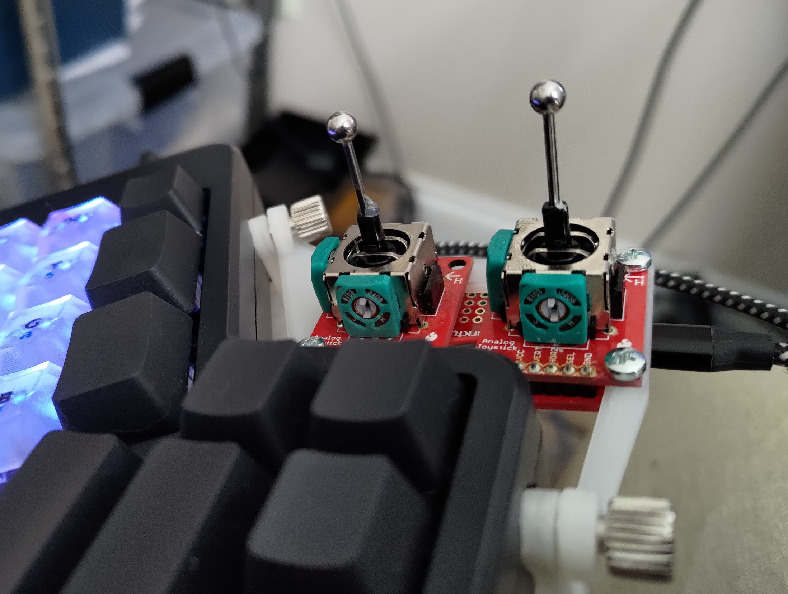

Orbit Rat
---------

THIS IS NOT A MOUSE REPLACEMENT. The Orbit Rat is a Teensy LC based PC input device designed
to facilitate panning and orbiting in CAD and graphic design software.

The concept is similar to the 3dconnexion navigation device. But the Orbit Rat has fewer 
degrees of freedom, much wider compatibility, and much lower cost. The Orbit Rat is not 
quite a space mouse, you see.

The OR is designed around a pair of small joysticks, like those on a gamepad controller. These 
joysticks then control pan and orbit in CAD, art, and graphic design programs by specially
emulating a mouse. _No special drivers or plugins needed_, works in any operating system.

This is not a regular joystick-controlled mouse. OR implements a special "rewind" operation
after every motion, which resets the mouse cursor position and unlocks near-infinite pan/orbit 
in any program that uses middle-click and drag for pan.

The cost to build one is around $30 USD. You could build it without any soldering, using
breadboard, but it will be bulky. You can easily solder it on protoboard with hand wiring.
It's also an easy circuit board to design.

Tested on Linux and Windows. Should work on Mac and mobile OS as well.

Tested to work with default settings in:

* Fusion 360
* Inkscape
* GIMP
* EAGLE CAD

# How it Works

This is pretty configurable, but by default...

When you tilt the stick outside the deadzone, Orbit Rat emulates a mouse holding down the middle
mouse button and starting a drag motion. This starts a pan action in lots of CAD and art software. 
The viewport will move as if you're panning with the mouse so long as you're tiling the stick.

If you think about how your favorite software works, when you finish the pan motion and let go the button,
the mouse is in a different part of the screen than when you started. You have to 
move the cursor back toward the middle of the screen to get more space if you want to continue the pan. 
With a traditional joystick-controlled mouse, this is torture.

But not so with Orbit Rat.

As you move, the OR tracks how much mouse motion it has sent to your computer. When you let
go of the stick, it very quickly moves the cursor back to where it was when you first tilted the stick. 
You can now continue the pan just by tilting the stick again. Or, you can continue your work 
with the cursor just where you left it.

The other stick works very similarly, but also emulates holding down the left shift keyboard button. 
This will activate an orbit in CAD software.

This is almost as much control as a dedicated "3d mouse" with special driver support. The beauty of 
Orbit Rat is that it works everywhere, in any operating system, in any application that uses click 
and drag for pan.

It can also do other stuff, like sending scroll wheel events and keyboard keys... but the rewind
operation is what it does uniquely.

# Features

* User defined list of stick modes and parameters to use. As many as you like until
  you run out of RAM. Most of what's discussed below can be set per mode.

* Cycle through your defined modes by clicking the stick buttons.

* REWIND - stick initiates a mouse movement, then OR returns the cursor to its starting
  position when you let go of the stick.

* STUTTER - similar to rewind mode, but continually moves a set distance, rewinds, then 
  repeats as long as you hold down the button. Not smooth, but allows "infinite" scrolling
  with limited screen real estate.

* SIMPLE - just be a mouse cursor, no rewind.

* SCROLL - stick movement sends scroll wheel commands. Useful for CAD zoom, or
  document scrolling.

* User-defined stick curves, so you can tweak the sensitivity of each stick.

* Invert or ignore any stick axis.

* Choose mouse button(s) and/or keyboard key that is held during mouse motion.

* Auto-calibrates joysticks by default (although not perfectly)

* Configurable to send HID joystick events if desired for custom application code.

* Parts are available circa Q2 2022. Teensy LC available despite chip shortage. 
  Joysticks and other parts available from hobby electronics suppliers (Sparkfun, 
  Adafruit).

# _Planned_ Features

* Optional support for Adafruit ANO rotary encoder and nav buttons
* RGB status LEDs (DotStar) for each stick's modes
* PCB reference design
* Left-handed PCB design

# Limitations

The Orbit Rat is fundamentally impersonating a mouse, so it doesn't have access to any
information a regular dumb mouse wouldn't have. It doesn't get any feedback from the 
operating system.

The main place this shows up is when the cursor hits the edge of the screen during a move.
The Orbit Rat thinks it's still moving the cursor, but the OS doesn't let it leave the screen.
When the OR goes to rewind the cursor motion at the end of the move, it has the wrong
idea of how much to rewind and overshoots.

Additionally, moue wheel scrolling in Linux and Windows is _not_ smooth. It goes in
chunky, discrete increments. Orbit Rat tries its best to send scroll events at a steady
rate, but without special drivers, it can't make the screen animation smooth when
scrolling (like e.g. Apple trackpad scrolling).

# Configuration and Building

Since you need the tools to upload the firmware anyway, I made things easy for me.
Orbit Rat is configured in source code and built with [PlatformIO](https://platformio.org/).

The easiest way to use PlatformIO is just to use VisualStudio Code (not Visual Studio) with
the free PlatformIO plugin from the marketplace. Standalone setups may work but I haven't
tested them.

When you first build, it may seem to stall for a very long time. PlatformIO is downloading a newer
compiler from a very slow connection. It gives no progress indicator. It seriously
took me 20 minutes to download. This only happens the first time you build. It also
may finish the download, try to compile, then say it failed... try again before
concluding it doesn't work.

Configuration is at the top of `main.cpp`. You can learn more about the options in 
`config_types.hpp`.

On your operation system you will need to set the "Teensyduino OrbitRat Mouse" acceleration
to 0. If you don't, the cursor will not return to the correct location. You should be able
to leave acceleration on for your regular mouse however you like it.

## Hardware

This isn't commercial hardware or software. You'll need to cobble together your
own hardware setup.

I'm using a Teensy LC as my microcontroller. I expect Teensy 4.0 would work, but
little is gained from its expanded capabilities. Teensy 3 might work; Teensy 2
is not compatible.

Assuming you'll use the software mostly unmodified, you need to hook up a pair of
potentiometer joysticks to the Teensy's analog inputs. That's pretty much it.

For the prototype I used the model of joystick sold on SparkFun, along with their 
breakout boards. I wired up the axes directly to the Teensy LC analog pins. I added 
pullup resistors on the switches There are internal pullups that could work, but I 
didn't test that way.

You can see my pin assignments in `main.cpp` under `axisPins` and `buttonPins`.
That's also where you can alter them if you'd like to wire the pins up differently.
Note that you _must_ use analog inputs for the joysticks.

## Software

The software isn't written to be especially efficient. It's written for a Teensy LC,
which has a 48MHz core clock. I haven't noticed that input rates are too low, so
I don't worry about a bit of fake floating point.

Calibration is quasi-automatic right now (although you can turn it off). By default, 
the center point is read at startup. Conservative endpoints are taken as a default,
but will expand if they receive a higher value from the hardware during operation. You 
can turn off both these features at the top of `main.cpp`.

## This is not a commercial venture, and the Orbit Rat is not for sale

The whole point of the project is that it's very, very cheap compared to the pro-grade
alternative. Stocking the parts, assembling them, and shipping them takes time
I have no interest in spending. And people have expectations of commercial products
(warranties, returns, etc.) that I don't want to deal with. I have a job, and a
few bucks just isn't worth the hassle.

To make it worth it to me, each unit would need to sell for $100 or more. And
that kind of defeats the purpose.

On the other hand, this is also an absolutely _ideal_ first microcontroller project.
You can build a completely decent version using just breakout- and bread-boards.
It is within your abilities to Orbit Rat. I believe in you.

You can also try one of the circuit boards from the `circuits` directory.
Most of those designs aren't tested, but they're a good starting point for
your design. When I get a design printed and tested, I will mark it 
conspicuously.
